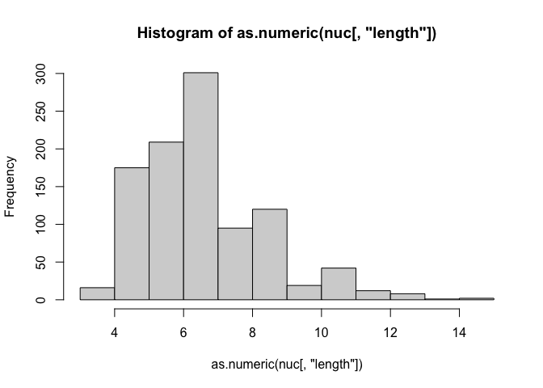

<!-- README.md is generated from README.Rmd. Please edit that file -->

# manacher

<!-- badges: start -->

[](https://github.com/jalberge/r-manacher/actions/workflows/R-CMD-check.yaml)

<!-- badges: end -->

My own try to implement Manacher’s algorithm to find the longest
palindromic substring. Also works for DNA sequences (with the convention
that a DNA palindrome cannot have a single central nucleotide).

## Installation

You can install the development version of manacher from
[GitHub](https://github.com/) with:

``` r
# install.packages("pak")
pak::pak("jalberge/r-manacher")
```

## Example

``` r
library(manacher)
## basic example code
manacher("kayak!")
#> [1] "kayak"
manacher_dna("CGGG", dna=TRUE)
#> $center
#> [1] 1.5
#> 
#> $start
#> [1] 1
#> 
#> $match
#> [1] "CG"
#> 
#> $length
#> [1] 2
```

### Random sequences of DNA

``` r
nuc <- sapply(1:1000, \(x) manacher_dna(paste0(sample(c("A", "C", "G", "T"), 50, replace = TRUE, prob = c(0.59, 0.41, 0.41, 0.59)), collapse = ""))) |> t() |> as.data.frame()
hist(as.numeric(nuc[,"length"]))
```


